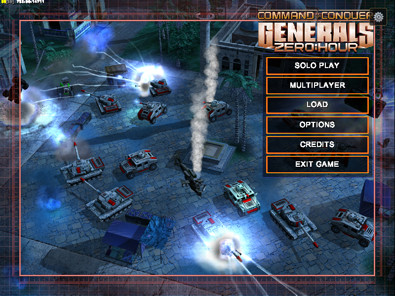
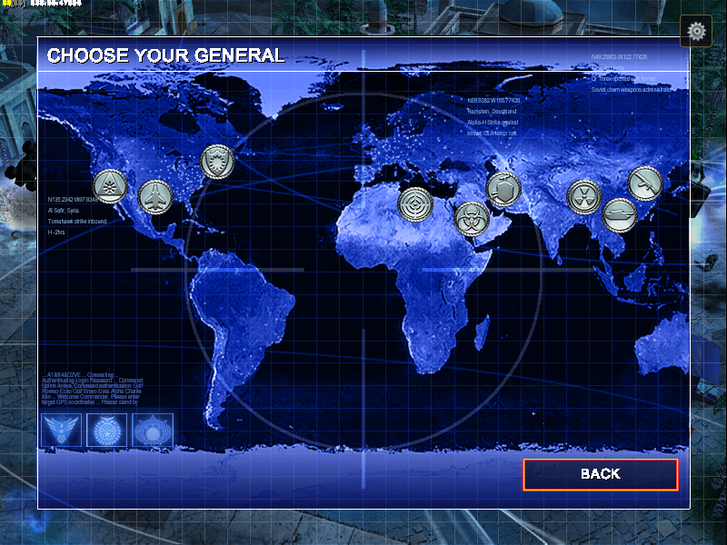
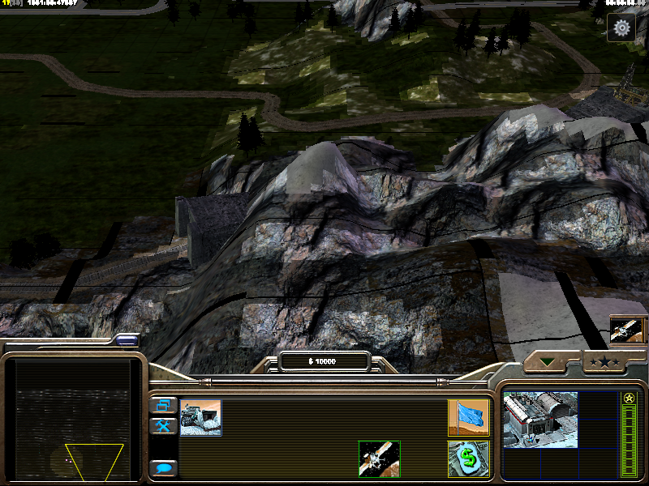

<div align="center">


# Generals-Web

### *C&C Generals Zero Hour, running in the browser via WebAssembly + WebGL 2.0*

*A browser port of the community [GeneralsGameCode](https://github.com/TheSuperHackers/GeneralsGameCode) engine, built by [TheodoryLabs](https://github.com/TheodoryLabs).*

</div>

---

> **Generals-Web** is a community port of the *Command & Conquer: Generals Zero Hour* game engine to WebAssembly/WebGL. It is derived from source code released by Electronic Arts Inc. under GPL-3.0 (with additional terms), via the [TheSuperHackers/GeneralsGameCode](https://github.com/TheSuperHackers/GeneralsGameCode) community project.
>
> **EA has not endorsed and does not support this product.** This project is not affiliated with, sponsored by, or approved by Electronic Arts Inc. "Command & Conquer" and "Command & Conquer: Generals" are trademarks of Electronic Arts Inc. This is a modified version of the original program and is not the original program.
>
> **No game assets are included or distributed.** This repository and its releases contain engine code only. To play, you must own a legitimate copy of *C&C Generals Zero Hour* (available in *C&C The Ultimate Collection* on [Steam](https://store.steampowered.com/bundle/39394) and the EA App) and load the game data from your own installation. Your files never leave your machine.

*(The same notice lives in [NOTICE](NOTICE).)*

<div align="center">



*The classic main menu, complete with the live 3D shellmap battle raging behind it, all rendered in WebGL.*

</div>

---

## What Is This?

This is a complete **Emscripten/WebAssembly port** of the *Command & Conquer: Generals Zero Hour* engine, a 2003 real-time strategy game originally built on C++98, DirectX 8, DirectInput, DirectSound, and Win32. It now boots, renders its menus, and plays skirmish matches in an ordinary browser tab.

The port adds a **web rendering and platform layer**: DirectX 8 is replaced by a custom OpenGL ES 3.0 (WebGL 2.0) backend, Win32 APIs are bridged to browser equivalents, `.big` game archives stream over HTTP Range requests, and the whole thing ships as a `.wasm` + `.js` + `.html` bundle.

**No plugin. No download. No Wine. Just the web.**

### By the numbers

| | |
|---|---|
| Inherited engine code | **~1.7 million lines** of C++ (4,228 files) |
| New platform layer | **~13,700 lines** (renderer, VFS, input, audio bridge, compatibility headers) |
| Upstream files touched | **96** (surgical `#ifdef __EMSCRIPTEN__` blocks) |
| Release artifact | **17 MB** `.wasm` + 128 KB `.js` + 11 KB `.html` |

That's a **0.8% platform layer relocating the other 99.2% into a browser.**

---

## Screenshots

<div align="center">



*The Generals Challenge war room: pick your opponent off a satellite map of the world.*



*Panning across Alpine Assault's mountains, real-time 3D terrain streaming straight over HTTP.*

</div>

---

## Running the Game

> **Full setup guide with all steps and troubleshooting → [SETUP.md](SETUP.md)**

Quick summary:

1. Download `GeneralsZH.html`, `GeneralsZH.js`, `GeneralsZH.wasm`, and `serve.py` from the [Releases page](https://github.com/TheodoryLabs/Generals-Web/releases)
2. Create an `assets/` folder next to those files and copy your `.big` game files into it (from your own Zero Hour install)
3. Run: `python3 serve.py`
4. Open **http://localhost:8888/GeneralsZH.html** in Chrome or Firefox

**Where to get the game** (the engine is open source, the game data is not):
- **[C&C The Ultimate Collection on Steam](https://store.steampowered.com/bundle/39394)**: includes Generals + Zero Hour, or the **EA App**
- Original 2003 retail / *The First Decade* discs work too · community guide: [cnc.community/generals/how-to-play](https://cnc.community/generals/how-to-play)

> **Note:** the existing `v0.4.0-web` release predates the working renderer (it builds, but predates the menu rendering). A fresh release built from the current tree is coming.

---

## Status

| Subsystem | Status |
|-----------|--------|
| WebGL 2.0 rendering (shaders, textures, lighting, fog, alpha) | ✅ Working |
| BigVFS, `.big` archives streamed via HTTP Range requests | ✅ Working |
| Input, keyboard, mouse, pointer lock, touch gestures | ✅ Working |
| Save/load persistence (IndexedDB via IDBFS) | ✅ Working |
| Custom memory pool | ✅ Working, re-enabled after root-causing the bounding-wall corruption (a debug feature assumed 8-byte pointers; on WASM32 it zeroed the neighboring block's vtable) |
| Shell map (animated menu background) | ✅ Working |
| Campaign / skirmish gameplay | ✅ Boots and plays, hardening ongoing |
| Audio | 🔶 Bridge written, a 1,428-line Miles-compatible layer on the Web Audio API, including an IMA ADPCM decoder; end-to-end wiring in progress |
| Networking | 🔶 GameSpy removed; a virtual-UDP seam is in place, ready for a WebRTC transport |
| Performance | 🔧 Active work, frame drops as bases grow; the VFS needs a range-cache |

---

## Web Port Architecture

The port replaces the Windows/DirectX layer with a browser-native stack while leaving core game logic completely untouched.

```
+----------------------------------------------+
|             Game Logic (C++)                  |
|     (GameEngine, Units, AI, Map, Physics)     |
|          UNCHANGED from original              |
+---------------------+------------------------+
                      |
           +----------+-----------+
           |  Platform Abstraction |
           |  (Emscripten layer)   |
           +----------+-----------+
                      |
    +-----------------+-----------------+
    |                 |                 |
    v                 v                 v
+--------+    +-----------+    +----------+
|WebGL 2 |    | Main Loop |    |HTTP Fetch|
|Renderer|    |  (rAF)    |    |.big VFS  |
|(GLES3) |    |           |    |Range Req |
+--------+    +-----------+    +----------+
    |                 |
    v                 v
 Browser          SDL2 Input
 Canvas       (KB/Mouse -> DirectInput)
```

### Key Files

| File | Purpose |
|------|---------|
| `cmake/web.cmake` | Emscripten toolchain config, the single entry point for web builds |
| `GeneralsMD/Code/Main/EmscriptenMain.cpp` | Web entry point (replaces WinMain.cpp) |
| `.../WW3D2/gles3_wrapper.cpp` + `emscripten_compat/` | DirectX 8 → OpenGL ES 3.0 compatibility layer |
| `.../WW3D2/gles3_big_vfs.cpp` | HTTP Range-request VFS for `.big` archives |
| `Core/.../WebAudioBridge/web_audio_bridge.cpp` | Miles-compatible audio layer on the Web Audio API |

The full annotated file map is in [docs/web-port/](docs/web-port/README.md).

---

## How the Renderer Works

The original game uses DirectX 8's **fixed-function pipeline**: a legacy graphics API with configurable texture blending, per-vertex lighting, material colors, and fog, all without shaders. WebGL 2.0 has no fixed-function pipeline.

The replacement happens **at the header level**: the build points `#include <d3d8.h>` at a drop-in COM-compatible implementation in `emscripten_compat/`. The engine's 4,745-line `dx8wrapper.cpp` still *thinks* it is talking to DirectX, every `IDirect3DDevice8` method (proper COM refcounting included) forwards into the GLES3 state machine in `gles3_wrapper.cpp`, which drives a universal GLSL vertex+fragment shader pair replicating the DX8 render states in real time:

- `SetRenderState` -> OpenGL state calls
- `SetTextureStageState` -> GLSL uniform uploads
- `DrawIndexedPrimitive` -> `glDrawElements`
- `CreateTexture` -> `glTexImage2D` with BGRA->RGBA swizzle
- `SetLight` / `LightEnable` -> GLSL light uniforms
- D3D fog (linear/exp/exp2) -> GLSL fog in fragment shader
- Alpha test -> `discard` in fragment shader

### Rendering Bugs Fixed

Six root-caused rendering bugs stand behind the working pipeline. COM refcounting leaks, the BGRA/RGBA swizzle, DXT mipmap uploads, cull-mode reversal, stale light uniforms, and the black-canvas vertex-stream clobber (found with per-frame draw counters, not a debugger). Full forensics in [docs/web-port/BUGS_AND_FIXES.md](docs/web-port/BUGS_AND_FIXES.md).

---

## Porting Timeline

**March 2026**: first sessions, 500+ compile errors audited, rendering pipeline stood up, first frame; **March 31**: the full engine links to wasm for the first time. **May 2026**: polish blitz and the black-canvas root cause, the menu renders; then the Web Audio bridge, the virtual-UDP network seam, and skirmish hardening. **July 2026**: the build becomes reproducible on Emscripten 6.0.2, clean checkout to running menu, verified in CI.

Full session-by-session details in [`docs/web-port/PORTING_LOG.md`](docs/web-port/PORTING_LOG.md).

## Building From Source

Everything you need is in **[BUILDING.md](BUILDING.md)**. The short version (tested with emsdk **6.0.2**):

```bash
emcmake cmake -G Ninja -B build-web \
  -DCMAKE_BUILD_TYPE=RelWithDebInfo \
  -DRTS_GAME=GeneralsMD \
  -DRTS_PLATFORM=web \
  -DCMAKE_PROJECT_INCLUDE=$PWD/cmake/web.cmake \
&& ninja -C build-web z_generals
```

---

## Contributing

Start with **[CONTRIBUTING.md](CONTRIBUTING.md)** and the curated **[good first issues](docs/web-port/GOOD-FIRST-ISSUES.md)**. Four lanes where help moves the needle most:

- **Web Audio wiring**: the Miles-compatible bridge is written; help take it end-to-end so the game is audible.
- **WebGL performance**: draw-call batching and render-path profiling; frames drop as bases grow.
- **WebRTC multiplayer**: the engine's UDP layer already has a virtual transport seam with a JS packet tap; build the WebRTC side on it.
- **Play and report**: own Zero Hour? Point the port at your game files and tell us what breaks. Every gameplay report hardens the port. (A play-in-one-click hosted version, where you still bring your own game files, is on the roadmap once performance and multiplayer make us proud.)

---

## Acknowledgements

This port stands on a lot of shoulders. Thank you:

- **[Electronic Arts](https://github.com/electronicarts/CnC_Generals_Zero_Hour)**: for the GPL-3.0 source release of Generals & Zero Hour (Feb 2025), and **Luke "CCHyper" Feenan** for the year of work restoring it to buildable state
- **[TheSuperHackers / GeneralsGameCode](https://github.com/TheSuperHackers/GeneralsGameCode)**: the community C++20 modernization this port is forked from; **our direct upstream**: the vast majority of code in this repository is theirs and EA's
- **[fbraz3 / GeneralsX](https://github.com/fbraz3/GeneralsX)**: the macOS/Linux port whose cross-platform groundwork (with **Fighter19** and **feliwir**'s earlier SDL/DXVK/OpenAL work) proved the engine could leave Windows, and inspired this project's name
- **[Emscripten](https://emscripten.org/)**, **[SDL](https://libsdl.org/)**, and the WebAssembly/WebGL ecosystem, the ground this port stands on
- **AI engineering shifts**: [Claude Code](https://claude.com/claude-code) (Anthropic) and [Google Antigravity](https://antigravity.google/) (Gemini), session-by-session porting work against a shared engineering log, with every fix verified live in a browser
- The **C&C community**: [cnc.community](https://cnc.community/), CnCNet, GameReplays, for keeping these games alive for two decades

If you find the browser part impressive, know that it steers 1.7 million lines of other people's excellent work.

---

## Known Issues

- **Chrome 149 stable and Chrome 150.0.7871.47 can crash the tab.** These Chrome versions ship a V8 garbage-collector bug (a compacting-GC evacuation fault; the fix is in V8 15.0.245.14+, one tag after what Chrome 150 stable shipped with) that can abort the renderer while large WebAssembly apps run. It is probabilistic: heavy allocation, such as starting a match, raises the odds. Since v0.5.2-web the port no longer emits the debug logging that made this much more likely, but the underlying browser bug remains until Chrome respins. Workarounds: fully quit Chrome and relaunch it with `--js-flags=--no-compact` (the flag applies per launch), or use Chrome Beta / a browser with V8 15.0.245.14+. Not a bug in this port; see the [postmortem](docs/web-port/POSTMORTEM-2026-07-07-gc-crash.md).
- **First map load freezes the tab for a while.** Asset streaming is synchronous by design (see [BigVFS notes](docs/web-port/GOOD-FIRST-ISSUES.md)); the range cache keeps repeats fast, but the first cold load of a map can hold the main thread for tens of seconds. If Chrome offers "Page Unresponsive", choose **Wait**.
- Frame rate dips as bases grow; draw-call batching is the active fix (see the performance issue on the tracker).

---

## Legal

- Source code is licensed under **GPL-3.0 with EA's additional terms**: see [LICENSE.md](LICENSE.md), preserved verbatim from EA's source release.
- The full project notice (non-affiliation, trademarks, no assets) is at the top of this README and in [NOTICE](NOTICE).
- This is a modified version of the original program, not the original program.
- "Command & Conquer" and "Command & Conquer: Generals" are trademarks of Electronic Arts Inc. No game assets, `.big` archives, art, audio, maps, or movies, are included in this repository, its history, or its releases.

---

<div align="center">

**TheodoryLabs**: Built with Emscripten, WebGL 2.0, and too much caffeine

</div>
