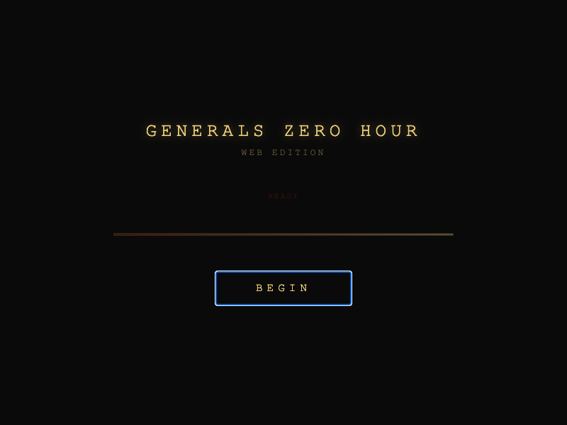
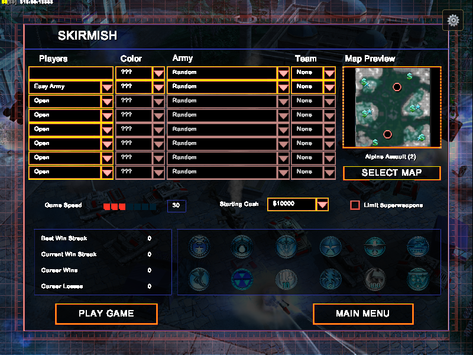
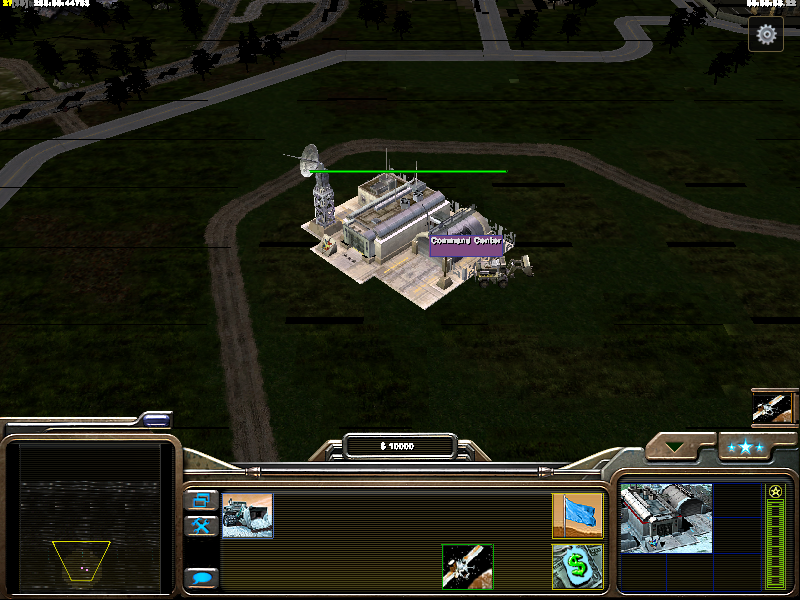
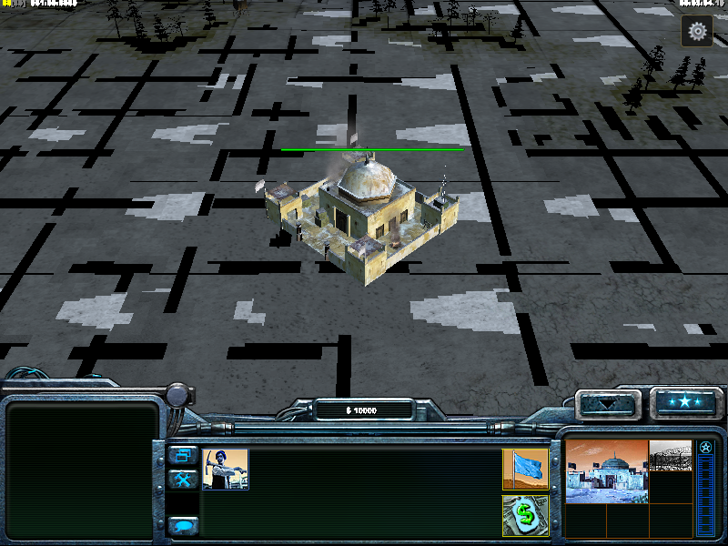

# Web Port Documentation

The engineering record of the WebAssembly/WebGL port. Start here:

| Document | What it is |
|---|---|
| [PORTING_LOG.md](PORTING_LOG.md) | **The session-by-session engineering diary** (Sessions 1–14, Mar–Jul 2026). Contributors: append your session here. |
| [GOOD-FIRST-ISSUES.md](GOOD-FIRST-ISSUES.md) | Curated, scoped starter issues with file anchors |
| [BUGS_AND_FIXES.md](BUGS_AND_FIXES.md) | Root-caused bug ledger (the war stories) |
| [PORT_TODO.md](PORT_TODO.md) | Working TODO tracker (historical; live status is in the [root README](../../README.md)) |
| [BUILD_INSTRUCTIONS.md](BUILD_INSTRUCTIONS.md) | *Historical* — the link-only workflow from the original dev machine. Current guide: [BUILDING.md](../../BUILDING.md) |
| [RENDERING_STATUS.md](RENDERING_STATUS.md) | *Historical* — rendering pipeline status as of March 2026 |
| [screenshots/](screenshots/) | Gallery of captures (see below) |

Legacy per-subsystem compile scripts from the original `.o`-surgery build pipeline live in [`scripts/legacy/`](../../scripts/legacy/) — superseded by the CMake build, kept for archaeology.

## Gallery

| | |
|---|---|
|  *The themed loading screen* |  *Main menu over the live shellmap* |
|  *Generals Challenge war room* |  *Skirmish lobby with map preview* |
|  *In-game HUD, Alpine Assault* |  *3D terrain streaming over HTTP* |
|  *Bitter Winter as the GLA* | |
